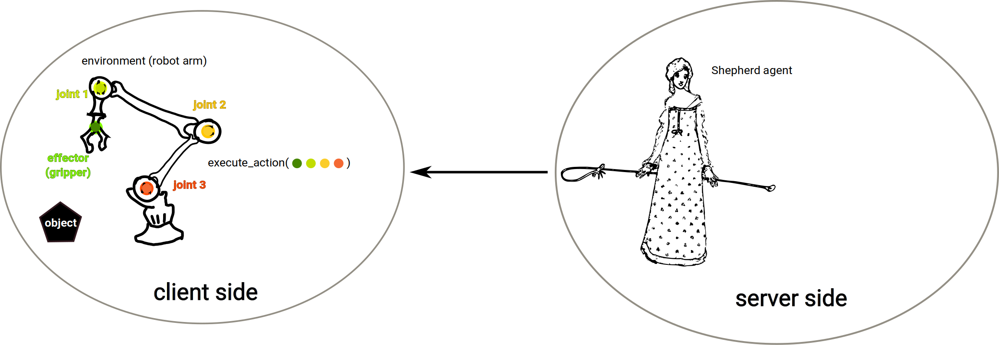

What is an Environment?
=======================

In our Shepherd agent creation section, and in our code exmaple of a client sending observations to the server, we considered CartPole, a very simple simulated environemnt often used by RL researchers and AI students. In this section, we go a little further and imagine a real-life task to be solved, controlling a robotic arm, and detail how to abstract this task into an environment able to interact witha  Shepherd agent. Note that an environment is in no way a simulator of the robotic arm; it can be viewed as a software bridge between the robot arm and the agent, allowing the agent to observe the current state of the arm, and to send actions to be executed by the arm. Reinforcement Learning can be applied to any real-life problem, as long as clear states and actions can be identified, as we describe below.

How to make an RL environment?
------------------------------

Let's say we have a robotic arm; we want this arm to learn how to manipulate an object using RL. Our robot arm has four sensors: three accelerometers, a camera at the base of the arm, and a force sensor on the effector, a gripper. At each timestep, the current state of the robot arm can be expressed as the concatenation of all 4 sensors readings, resulting in a vector of 4 floating point values, for instance. This vector can be sent to the reinforcement learning agent, which in turn will send an action based on the current state of the arm.

For the agent to choose an action be executed by the robot arm, there must be some actions available to the agent. Our arm has three joints, which can each be activated by a motor, and an effector (the gripper). Each motor controlling a joint can be activated given a floating point value, for instance, as well as the gripper. As a result, an action is expressed as a vector of four floats, each controlling one of the three joints and the gripper. In this particular example, since all four components of an action is a floating point value, there is an infinite amount of different actions at the disposal of the agent. Hence, the action space is said to be continuous, in opposition to discrete.

Interactions between environment and agent
------------------------------------------

The first step is to have the environment on the client side feel gather an observation of the current state of the arm. The client sends this observation to the server, on which the Shepher RL agent is.

Based on the received observation, the Shepherd agent computes an action. The server sends the action to the client.

The client receives the action, passes it to the environment. The controller of the robot arm on the client side executes the action received from teh agent.

Afterwards, a new state can be observed. The cycle continues.

Timestep, episode and experience
--------------------------------

A timesteps is composed of three steps mentioned above: 1) observing a state, 2) computing an action, 3) executing the action. Observing the new state resulting from executing the action is the first step of the next timestep.

An episode is composed of a number of timesteps. The number of timesteps in an episode can be determined by answering the following question: when can the task be considered "done"? In our robot arm example, we could say that the task is over when the object has been picked up and put down on a target spot by the arm. A reinforcement learner is going to try to perform that task over and over again until it does it perfectly. The amount of timesteps in an episode could be however many timesteps occur before the object has correctly been placed on the target spot, hence, each episode has different length. In contrast, one could decide on an arbitrary, fixed amount of timesteps, after the episode ends, whether or not the goal has been reached.

.. image:: pictures/episode.png
    :width: 800
    :alt: Alternative text

At the end of an episode, there must be a reset function, which puts the environment in an initial state. In our example, at the end of each episode, the object must be put back at its initial spot.

An experience is composed of several episodes.

One agent, several executions
-----------------------------

Now let's say the user owns not one, but several robotic arms, and wants each of these arms to share their knowledge with each other to help them learn faster, instead of each learning the task from scratch on their own. Each of these arms can log in the Shepherd server with the same API key, corresponding to the one Shepherd agent executing the algorithm the user wants to use, and start sending its observation to that agent. This way, all arms send their observations and rewards to the same Shepherd agent, which in turn makes sure that an efficient transfer of knowledge between robot arms occurs. This has a two-fold advantage: all arms can potentially learn the task faster, and if the user wants to plug yet another robotic arm, this lastly added arm will start executing an already well-trained behavior, retrieved from the other arms' saved models.

